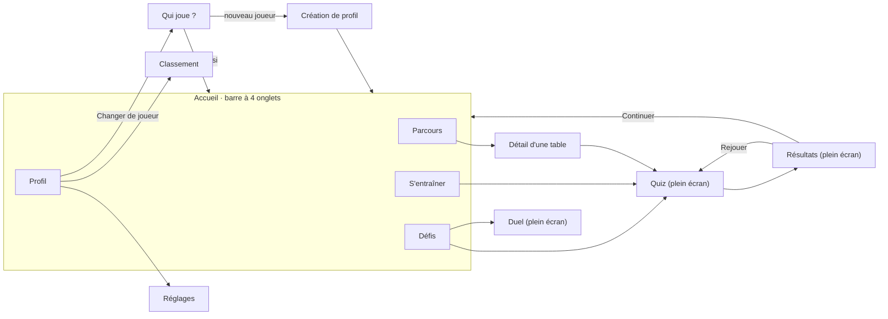
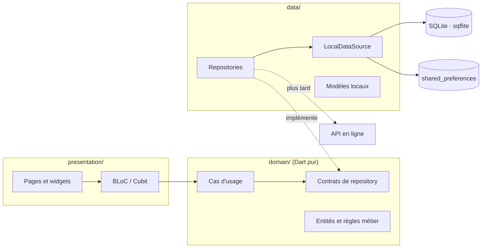

# Spécifications — Kid Matix

> **Copie de référence dans le dépôt.** Exportée le 9 octobre 2026 depuis le
> document de spécifications d'origine
> (<https://claude.ai/code/artifact/930d8c2c-f367-4566-b936-df96c5873480>).
> C'est désormais ce fichier qui fait foi : toute évolution du produit se
> note ici.
>
> **Ordre de priorité en cas de contradiction :** `docs/rules/*` (règles de
> code) > `CLAUDE.md` et `docs/decisions.md` > `docs/product/task-breakdown.md`
> > ce fichier.
>
> **Ce qui a été aligné par rapport au document d'origine** (les règles de
> code sont arrivées après sa rédaction) :
>
> - Section 10 : note sur les noms de champs, qui sont en anglais dans le code.
> - Section 11 : structure des dossiers, `DataState` à la place de `Result`,
>   `ProfileSessionService` à la place d'`ActiveProfileCubit`, noms de
>   fonctionnalités au singulier, liste des paquets.
> - Section 12 : emplacement d'un nouveau domaine.
> - Les deux schémas interactifs sont remplacés par des diagrammes Mermaid.
>
> « Kid Matix » est un nom provisoire (voir section 16).

## 1. Vision et objectifs

Une application mobile Flutter, hors ligne dans sa première version, qui amène un enfant à connaître par cœur les tables de 1 à 12 grâce à des sessions de jeu de 3 à 5 minutes. Elle reprend les ressorts de Duolingo (parcours, série quotidienne, XP, récompenses) et les adapte à un seul sujet : la multiplication.

**Public**

- Utilisateur : enfant à partir de 6 ans, lecteur débutant ou confirmé, qui joue seul. La multiplication vise surtout les 6 à 11 ans ; les domaines à venir pourront servir des enfants plus âgés.

**Objectifs produit**

- Faire mémoriser les 120 faits de multiplication (1 × 1 à 12 × 10) jusqu'à une réponse juste en moins de 3 secondes.
- Donner envie de revenir chaque jour : une session doit être courte, gagnable et récompensée.
- Permettre à plusieurs enfants de partager un téléphone, chacun avec son pseudo, son score et sa progression.
- Fonctionner sans back-end ni compte dans la version 1, puis s'ouvrir à un mode en ligne avec classements (section 13).
- Accueillir plus tard d'autres domaines et d'autres types de quiz sans réécrire l'app (section 12).

**Critères de réussite**

- Un enfant lance un quiz en 2 appuis au plus depuis l'accueil.
- Une étape du parcours se termine en moins de 5 minutes.
- Un nouveau joueur crée son profil et joue sa première question en moins de 60 secondes, sans aide d'un adulte.
- Chaque fait de multiplication a un niveau de maîtrise visible par l'enfant.

## 2. Principes de conception

Six règles guident chaque écran ; elles priment sur toute fonctionnalité qui les contredirait.

1. **Une seule action par écran.** Gros boutons, peu de texte, icônes parlantes. Un enfant de 6 ans doit comprendre sans lire.
2. **Des sessions courtes.** 10 questions par étape, avec une barre de progression toujours visible.
3. **L'erreur enseigne, elle ne punit pas.** Après une erreur, l'app montre la bonne réponse et repose la question plus tard dans la même session. Pas de vies dans le parcours d'apprentissage.
4. **Le chrono motive, il ne stresse pas.** Il n'apparaît qu'à partir des étapes de vitesse et peut être désactivé par profil.
5. **Un retour immédiat.** Chaque réponse déclenche un signal visuel et sonore en moins de 100 ms.
6. **Un espace sûr.** Aucune publicité, aucun achat, aucun lien externe, aucune connexion réseau dans la version 1.

## 3. Profils et connexion locale

L'identité d'un joueur est un pseudo unique sur le téléphone, sans mot de passe ni e-mail. Chaque profil possède sa propre progression, ses scores et ses réglages ; rien n'est partagé entre profils hors du classement local.

**Écran « Qui joue ? »**

- Affiché au lancement dès qu'il existe au moins un profil : une grille de cartes (avatar, pseudo, niveau, série en cours).
- Un appui sur une carte ouvre la session de ce joueur. Un bouton « Nouveau joueur » lance la création.
- Au tout premier lancement, l'app ouvre directement la création de profil.

**Création d'un profil**

- Pseudo : 2 à 12 caractères, lettres, chiffres et espaces. L'unicité ignore la casse et les accents (« Awa » et « awa » sont le même pseudo).
- Avatar : choix parmi 12 personnages. Couleur de fond au choix.
- Message d'erreur adapté à l'enfant si le pseudo existe déjà : « Ce nom est déjà pris sur ce téléphone ».
- Limite : 10 profils par appareil.

**Gestion**

- Changer de joueur : bouton dans l'onglet Profil, retour à « Qui joue ? » sans perte de données.
- Renommer, changer d'avatar : libre pour l'enfant.
- Réinitialiser ou supprimer un profil : depuis l'onglet Profil, après une confirmation où l'enfant retape son pseudo. La suppression efface toutes les données liées.
- Toutes les données de jeu portent l'identifiant du profil ; aucune requête ne lit les données d'un autre joueur, sauf le classement.

## 4. Parcours d'apprentissage

L'accueil est une carte défilante de 12 mondes, un par table. Chaque monde contient 5 étapes qui mènent de la découverte au combat de boss.

| Étape | Contenu | Formats | Chrono |
| --- | --- | --- | --- |
| 1. Découverte | La table affichée en entier, une astuce, puis les 10 questions de la table dans l'ordre | Choix multiple | Non |
| 2. Entraînement | 10 questions dans le désordre | Choix multiple, vrai ou faux | Non |
| 3. Écriture | 10 questions dans le désordre | Saisie, opération à trous | Non |
| 4. Vitesse | 10 questions dans le désordre | Tous | 10 s par question |
| 5. Combat de boss | Jusqu'à 20 questions contre le monstre de la table : ses 10 faits, puis des rappels des tables déjà vues (section 7) | Tous | 8 s par question |

**Notation**

- Chaque étape donne 0 à 3 étoiles : 1 étoile dès 60 % de bonnes réponses, 2 dès 80 %, 3 pour un sans-faute.
- Le meilleur résultat est conservé ; une étape peut être rejouée à volonté.
- Vaincre le boss pose une couronne sur la table. La couronne devient dorée quand tous les faits de la table sont maîtrisés (voir section 6).

**Déblocage**

- Une étape s'ouvre quand la précédente a au moins 1 étoile.
- La table suivante s'ouvre dès que l'étape 3 est validée, pour qu'un enfant lent au chrono ne reste pas bloqué.
- Ordre proposé, du plus simple au plus difficile : 1, 2, 10, 5, 3, 4, 6, 9, 7, 8, 11, 12.
- Après chaque groupe de 3 tables, une étape « Révision » de 15 questions mélange les tables déjà vues.
- Un réglage « Tout débloquer » ouvre les 12 tables, pour suivre l'ordre de l'école.

**Test de départ (optionnel)**

À la création du profil, 12 questions rapides, une par table, permettent d'ouvrir d'emblée les tables déjà connues. Les étoiles restent à gagner.

## 5. Questions, modes de jeu et chronomètre

Six formats de questions alternent dans un même quiz pour éviter la routine ; l'enfant choisit ou écrit selon le format.

| Format | Exemple | Réponse de l'enfant |
| --- | --- | --- |
| Choix multiple | 7 × 8 = ? | Touche 1 bouton parmi 4 |
| Saisie | 6 × 9 = ? | Écrit le résultat sur un pavé numérique intégré, puis valide |
| Opération à trous | 7 × ? = 56 | Choisit ou écrit le nombre manquant |
| Vrai ou faux | 6 × 7 = 48 | Touche Vrai ou Faux |
| Trouver l'opération | Quelle multiplication donne 24 ? | Touche 1 opération parmi 4 |
| Relier les paires | 4 opérations et 4 résultats | Associe chaque opération à son résultat |

**Règles de génération**

- Les mauvaises réponses d'un choix multiple sont plausibles : résultat voisin dans la même table (7 × 7, 7 × 9), résultat de la table voisine (6 × 8, 8 × 8), confusion avec l'addition (7 + 8), chiffres inversés (65 pour 56).
- Jamais deux choix identiques, jamais de nombre négatif ; la position de la bonne réponse est aléatoire.
- Une affirmation « vrai ou faux » est vraie une fois sur deux ; quand elle est fausse, l'erreur suit les mêmes règles de plausibilité.
- Le pavé numérique est celui de l'app, pas le clavier du téléphone : chiffres 0 à 9, Effacer, Valider.
- Le même fait n'apparaît jamais deux fois de suite.

**Modes de jeu**

| Mode | Principe | Chrono |
| --- | --- | --- |
| Parcours | Les étapes de la carte (section 4) | Selon l'étape |
| Entraînement libre | L'enfant choisit une ou plusieurs tables, 10, 20 ou 30 questions, avec ou sans chrono | Au choix |
| Révision du jour | 10 questions choisies par le moteur parmi les faits à revoir | Non |
| Contre-la-montre | Le plus de bonnes réponses en 60 secondes ; record personnel par profil | 60 s au total |
| Survie | 3 vies, une erreur en retire une ; le temps par question raccourcit au fil de la partie | 10 s, puis moins |
| Chasse aux monstres | 10 questions sur les faits que l'enfant rate le plus (section 7) | Non |
| Duel | Deux joueurs sur le même téléphone ; le premier à 10 bonnes réponses gagne (section 7) | Non, c'est une course |

**Chronomètre**

- Chrono par question : une barre qui se vide, sans chiffres anxiogènes. Elle change de couleur dans les 3 dernières secondes.
- Temps écoulé : la question compte comme une erreur et la bonne réponse s'affiche.
- Réponse juste en moins de 3 secondes : mention « Éclair » et bonus d'XP.
- Le temps de réponse est mesuré en silence dans tous les modes, même sans chrono affiché ; il alimente le moteur pédagogique.
- Si l'app passe en arrière-plan, le chrono se met en pause. En Contre-la-montre et en Survie, la question en cours est remplacée au retour.
- Réglage par profil : chrono normal, chrono détendu (temps × 1,5) ou sans chrono.

## 6. Moteur pédagogique

L'app suit la maîtrise de chaque fait de multiplication, pour chaque profil, et fait revenir les faits fragiles au bon moment. C'est ce qui la distingue d'un simple générateur de quiz.

**Ce qui est mémorisé par fait et par profil**

- Nombre de présentations et de bonnes réponses.
- Temps des 5 dernières réponses.
- Boîte de révision (0 à 5) et date de prochaine révision.

**Répétition espacée (système de boîtes)**

| Boîte | Statut affiché | Le fait revient après |
| --- | --- | --- |
| 0 | Nouveau | Jamais présenté |
| 1 | À revoir | Plus tard dans la session, puis le lendemain |
| 2 | En cours | 2 jours |
| 3 | En cours | 4 jours |
| 4 | Acquis | 7 jours |
| 5 | Maîtrisé | 15 jours |

- Bonne réponse : le fait monte d'une boîte. Une réponse en choix multiple ou en vrai ou faux ne fait pas dépasser la boîte 3 ; il faut une saisie pour aller plus haut.
- Erreur ou temps écoulé : le fait retourne en boîte 1.
- Un fait est « maîtrisé » quand il est en boîte 5 et que ses 5 dernières réponses ont un temps médian inférieur à 3 secondes.

**Choix des questions**

- Parcours : les faits de la table en cours. Le combat de boss ajoute jusqu'à 10 faits des tables déjà vues, pris parmi les plus fragiles.
- Révision du jour : d'abord les faits dont la date de révision est passée, puis ceux au plus faible taux de réussite.
- Entraînement libre et défis : tirage pondéré, les boîtes basses sortent plus souvent.
- Hors de leur propre table, les faits en × 1 et × 10 sortent deux fois moins souvent.
- Un fait raté revient 3 questions plus tard dans la même session, une seule fois.

**Adaptation à l'enfant**

- Format selon le niveau : boîtes 1 et 2 en choix multiple d'abord, boîtes 3 et plus en saisie et opérations à trous.
- Deux erreurs sur le même fait dans une session : une fiche d'aide s'affiche, avec la table et une grille de points (7 rangées de 8 pour 7 × 8).
- Après une erreur sur 7 × 8, l'app rappelle que 8 × 7 donne le même résultat. Les deux faits restent suivis séparément.
- Chaque table a une astuce montrée à l'étape Découverte (par exemple : les résultats de la table de 5 finissent par 0 ou 5).

## 7. Gamification

Huit mécaniques récompensent la régularité et le progrès, jamais le seul talent : un enfant qui débute doit pouvoir gagner autant qu'un enfant avancé.

| Mécanique | Règle | Ce qu'elle encourage |
| --- | --- | --- |
| XP | 10 par bonne réponse, + 5 si réponse « Éclair », + 20 par étape terminée, + 50 pour un sans-faute | Jouer et s'appliquer |
| Niveau du joueur | Le niveau N demande 100 × N XP de plus que le précédent | Progresser sur la durée |
| Étoiles | 0 à 3 par étape du parcours | Rejouer pour faire mieux |
| Couronnes | 1 par table, dorée quand la table est maîtrisée | Finir chaque table |
| Série quotidienne | + 1 par jour avec au moins une session terminée | Revenir chaque jour |
| Objectif du jour | 20, 50 ou 100 XP au choix, avec jauge sur l'accueil | Doser l'effort |
| Combo | Compteur de bonnes réponses d'affilée, palier fêté à 3, 5 et 10 | Rester concentré |
| Badges | Débloqués sur des exploits précis | Explorer tous les modes |

**Série quotidienne**

- Le jour est celui de l'horloge du téléphone. Si la date recule, la série ne bouge pas.
- Un « joker » par semaine sauve automatiquement la série après un jour manqué.
- Une série perdue garde son record : « Ta meilleure série : 12 jours ».

**Badges du lancement**

- Premier pas : terminer une première étape.
- Sans-faute : finir une étape à 100 %.
- Éclair : 20 réponses « Éclair » au total.
- Régulier : 7 jours de série.
- Dompteur de la table de 7 : couronne sur la table de 7 (un badge par table).
- Sprinter : 20 bonnes réponses en Contre-la-montre.
- Survivant : 30 bonnes réponses en Survie (arrive avec ce mode).
- Les 120 : tous les faits maîtrisés.

**Mascotte et récompenses**

- Une mascotte accompagne l'enfant : elle encourage après une erreur, fête les paliers et rappelle l'objectif du jour.
- Chaque fin d'étape ouvre un écran de célébration (étoiles, XP gagnés, progression du niveau).
- Les vies n'existent qu'en mode Survie. Aucune mécanique ne bloque l'accès au jeu.

**Combat de boss**

La dernière étape de chaque table est un duel contre le monstre de cette table.

- Le boss a 12 points de vie. Une bonne réponse lui en retire 1 ; une réponse « Éclair » est un coup critique qui en retire 2.
- Une erreur ne coûte rien à l'enfant : le monstre riposte à l'écran, la bonne réponse s'affiche et le fait revient plus tard dans le combat.
- Le combat est gagné quand la vie du boss tombe à zéro, soit 60 % de bonnes réponses sans coup critique. Après 20 questions sans y parvenir, le monstre s'enfuit et l'enfant peut retenter.
- Les étoiles suivent la règle habituelle, calculée sur les questions jouées.
- Chaque table a son monstre ; le vaincre l'ajoute à la collection du profil.

**Mascotte qui grandit**

- La mascotte reçoit un nom par défaut, que l'enfant peut changer dans l'onglet Profil.
- Elle passe par 5 stades, atteints aux niveaux 1, 5, 10, 20 et 30 du joueur.
- Chaque couronne et certains badges débloquent un accessoire (chapeau, cape, lunettes) ; l'enfant choisit ceux qu'elle porte.
- Elle apparaît sur l'accueil, pendant le quiz et sur l'écran de résultats.
- Rien ne s'achète et rien ne se perd : la mascotte ne régresse jamais, même après une série interrompue.

**« Mes monstres »**

- Un fait raté au moins 2 fois et encore fragile (boîtes 1 à 3) devient un petit monstre. L'enfant en voit 5 au plus, les plus coriaces.
- La Chasse aux monstres est un quiz de 10 questions centré sur ces faits.
- Quand le fait atteint le statut « Acquis », le monstre est apprivoisé et rejoint la collection.
- Aucune donnée nouvelle n'est nécessaire : tout se déduit de la maîtrise des items (section 6).

**Duel sur le même téléphone**

- L'écran est coupé en deux moitiés tête-bêche ; chaque joueur a sa question et ses 4 boutons de réponse.
- Chaque joueur choisit son profil, ou joue en invité.
- Chacun reçoit des questions de ses propres tables débloquées, pour qu'un petit puisse battre un grand.
- Le premier à 10 bonnes réponses gagne. Une erreur bloque les boutons du joueur pendant 2 secondes.
- Le duel rapporte des XP aux profils qui jouent, mais ne modifie pas la maîtrise des faits.

**Défi par code**

- À la fin d'un Entraînement libre ou d'un Contre-la-montre, « Défier un ami » affiche un code d'une dizaine de caractères.
- Le code contient les tables choisies, le mode, le tirage des questions et le score à battre. Aucun réseau n'est utilisé.
- L'ami saisit le code dans l'onglet Défis, joue exactement les mêmes questions, puis voit les deux scores côte à côte.
- Le même code donne les mêmes questions sur tout téléphone : le tirage repose sur une graine, et le code porte la version du générateur.

**Classement local**

Les profils du téléphone sont classés par XP gagnés dans la semaine, remis à zéro chaque lundi. Il se masque dans les réglages, car il peut décourager dans une fratrie d'âges différents.

## 8. Écrans et navigation

L'app compte 12 écrans, organisés autour d'une barre inférieure à 4 onglets : Parcours, S'entraîner, Défis, Profil. Le quiz et les résultats s'ouvrent en plein écran, sans barre.



Les onglets Parcours, S'entraîner et Défis lancent tous un quiz ; après les résultats, l'enfant revient à l'accueil. Un nouveau joueur passe par la création de profil avant d'y arriver.

| Écran | Contenu | Actions |
| --- | --- | --- |
| Qui joue ? | Cartes des profils | Choisir un joueur, créer un joueur |
| Création de profil | Pseudo, avatar, couleur | Valider, passer le test de départ |
| Parcours (accueil) | Carte des 12 tables ; bandeau avec série, XP du jour et niveau | Ouvrir une table |
| Détail d'une table | Les 5 étapes et leurs étoiles, bouton « Voir la table » | Lancer une étape |
| Quiz | Barre de progression, chrono, combo, question, zone de réponse | Répondre, quitter |
| Résultats | Étoiles, XP gagnés, précision, temps moyen, faits à revoir, badges obtenus | Continuer, rejouer |
| S'entraîner | Choix des tables, du nombre de questions et du chrono | Lancer |
| Défis | Révision du jour, Contre-la-montre, Survie, Chasse aux monstres, Duel, saisie d'un code de défi, records personnels | Lancer un défi |
| Profil | Avatar, mascotte et ses accessoires, niveau, série, badges, collection de monstres, grille de maîtrise 12 × 10 colorée par statut | Changer de joueur, ouvrir les réglages, réinitialiser ou supprimer le profil |
| Classement | Profils du téléphone classés par XP de la semaine | Aucune |
| Réglages | Sons, vibrations, mode de chrono, objectif du jour, rappel quotidien, « Tout débloquer », affichage du classement | Modifier |
| Duel | Écran coupé en deux moitiés tête-bêche, une question et 4 boutons par joueur, les deux scores | Répondre, rejouer, quitter |

**Règles de navigation**

- Quitter un quiz demande une confirmation. Les réponses déjà données restent comptées dans la maîtrise des faits ; les XP et étoiles de l'étape ne sont pas attribués.
- Après les résultats, « Continuer » ramène à l'écran d'origine avec l'étape suivante mise en avant.
- L'app est en portrait uniquement.

## 9. Retours, sons et accessibilité

Chaque réponse reçoit un retour clair en moins de 100 ms, et aucune information ne passe par la couleur seule.

**Retours en cours de quiz**

- Bonne réponse : le bouton passe au vert avec une coche, un son court, les XP s'envolent vers le compteur.
- Mauvaise réponse : le bouton passe au rouge avec une croix, une vibration légère, puis l'opération complète s'affiche (7 × 8 = 56) jusqu'à l'appui sur « Continuer ».
- Paliers de combo, fin d'étape, montée de niveau et badge : animation de célébration courte, que l'enfant peut passer d'un appui.

**Sons et animations**

- Sons et vibrations se coupent séparément dans les réglages.
- Transitions de 300 ms au plus ; animations fluides à 60 images par seconde sur un téléphone d'entrée de gamme.
- Un réglage « Animations réduites » remplace les célébrations par un écran fixe.

**Accessibilité**

- Zones tactiles de 48 dp au minimum, 56 dp pour les boutons de réponse.
- Contraste des textes conforme au niveau AA des WCAG.
- Respect de la taille de police du système jusqu'à 130 %, sans texte coupé.
- Libellés pour les lecteurs d'écran sur tous les boutons et sur chaque question.
- Le mode sans chrono rend tous les contenus du parcours accessibles sans contrainte de temps.

**Langue**

L'app sort en français. Tous les textes sont externalisés pour ajouter d'autres langues sans toucher au code.

## 10. Données et stockage local

Toutes les données vivent dans une base SQLite sur le téléphone, via sqflite ; les quelques réglages de l'appareil passent par `shared_preferences`. Les données sont relationnelles (profils, faits, sessions), et sqflite donne un accès direct à SQLite, stable et maintenu, sans génération de code, alors qu'Isar et Hive d'origine ne sont plus suivis par leur auteur ([comparatif de juin 2026](https://luci-studio.com/blog/the-flutter-local-database-landscape-in-2026-a-maintenance-first-guide-fe6d267c/)).

> **Noms dans le code.** Les champs ci-dessous sont décrits en français pour
> la lecture ; le code et le schéma sont en anglais (`pseudoNormalise` →
> `normalizedNickname` / `normalized_nickname`, `itemCle` → `itemKey`,
> `boite` → `box`, `prochaineRevisionLe` → `nextReviewAt`, `creeLe` →
> `createdAt`…). Les entités se nomment `XxxEntity`, les modèles
> `XxxLocalModel`, les tables sont au singulier en snake_case (`profile`,
> `profile_settings`, `item_progress`, `stage_progress`, `quiz_session`,
> `streak`, `badge_unlock`, `record`).

| Entité | Champs principaux | Rôle |
| --- | --- | --- |
| Profile | id (UUID), compteDistantId (vide en version 1), pseudo, pseudoNormalise (unique), avatarId, couleur, mascotteNom, mascotteAccessoires, xpTotal, niveau, creeLe, dernierJeuLe | Un joueur |
| ProfileSettings | profileId, modeChrono, objectifJourXp, sons, vibrations, animationsReduites, toutDebloque | Réglages d'un joueur |
| ItemProgress | profileId, domaineId, itemCle, presentations, reussites, cinqDerniersTempsMs, boite, prochaineRevisionLe | Maîtrise d'un item ; pour la multiplication, un fait a × b |
| StageProgress | profileId, domaineId, uniteId, etape, meilleuresEtoiles, meilleurScore, termineLe | Avancement dans le parcours |
| QuizSession | id (UUID), profileId, domaineId, mode, debutLe, dureeMs, nbQuestions, nbReussites, xpGagnes | Historique, temps de jeu, classement |
| Streak | profileId, serieEnCours, meilleureSerie, dernierJourJoue, jokerDisponible | Série quotidienne |
| BadgeUnlock | profileId, badgeId, obtenuLe | Badges gagnés |
| Record | profileId, domaineId, mode, meilleurScore, obtenuLe | Records des défis |
| Réglages de l'appareil | dernierProfilId, classementActif, rappelHeure | Hors base, dans `shared_preferences` |

**Règles**

- Chaque table de jeu porte `profileId` en clé étrangère ; supprimer un profil supprime ses lignes en cascade.
- ItemProgress compte au plus 120 lignes par profil pour la multiplication, créées à la première présentation de chaque fait.
- La fin d'une session écrit en une seule transaction : session, XP, niveau, étoiles, série, badges, records.
- Le contenu fixe (étapes, astuces, badges, avatars) reste dans le code et les ressources de l'app, pas en base.
- Le schéma est versionné ; chaque changement a une migration testée.

Pour préparer le mode en ligne (section 13), chaque ligne porte aussi une date de dernière modification et une date de suppression logique. Les colonnes `domaineId` valent toujours « multiplication » en version 1.

**Limite à connaître**

Sans back-end, désinstaller l'app ou changer de téléphone efface la progression. Un export et un import de sauvegarde par fichier sont prévus après le lancement (section 15), puis une sauvegarde sur compte avec le mode en ligne (section 13).

## 11. Architecture technique

Le code suit la Clean Architecture en trois couches, découpée par fonctionnalité, avec BLoC pour l'état de l'interface. Les dépendances pointent toujours vers le domaine, qui reste du Dart pur.



La présentation appelle les cas d'usage du domaine ; la couche de données implémente ses contrats et parle seule à la base, puis à l'API en ligne quand elle existera.

**Structure des dossiers**

```
lib/
  main.dart
  core/             # uniquement le code utilisé par au moins 2 fonctionnalités
    constants/  di/  entities/  error/  extensions/  router/
    services/   storage/  theme/  usecases/  utils/  widgets/
  l10n/             # textes traduisibles (ARB + AppLocalizations générées)
  features/         # une fonctionnalité = un dossier au singulier
    profile/          # F1
      domain/         # entities/  repositories/  usecases/
      data/           # models/  datasources/ (local, puis remote)  repositories/
      presentation/   # bloc/  pages/  widgets/
      injection.dart
    multiplication/   # F2 · seul domaine de la version 1
    quiz/             # F3 · session, QuizBloc, widgets de réponse
    mastery/          # F4 · maîtrise des items, répétition espacée
    learning_path/    # F5, F6 · parcours et combat de boss
    reward/           # F7 · XP, série, badges, classement
    mascot/           # F8
    challenge/        # F9, F12+ · entraînement, défis
    setting/          # F10
```

Il n'y a pas de dossier `app/` : routeur, thème, injection et widgets partagés
sont dans `core/`. Une fonctionnalité n'en importe jamais une autre : une
entité partagée va dans `core/entities/`, une capacité partagée passe par une
interface de `core/services/` implémentée par la fonctionnalité qui la
possède. Les contrats du moteur de quiz (`LearningDomain`, `QuestionType`,
`Question`) sont dans `core/`.

**Règles d'architecture**

- Le domaine n'importe ni Flutter, ni sqflite, ni aucun paquet d'interface.
- Chaque cas d'usage fait une seule chose. Chaque repository renvoie un `DataState<T>` scellé (`DataSuccess` ou `DataFailed` portant une `AppException` typée avec son `AppErrorCode`) ; aucune exception ne remonte jusqu'à l'interface.
- Les widgets n'appellent jamais un repository : ils envoient des événements à un BLoC et affichent ses états. Un BLoC n'appelle que des cas d'usage, n'est jamais enregistré dans GetIt et est créé par un `BlocProvider` à l'entrée de sa page.
- L'horloge, le générateur aléatoire et le ticker du chrono sont injectés, pour des tests reproductibles.
- Le chrono vit dans le QuizBloc, alimenté par un ticker ; aucun `Timer` dans les widgets.
- sqflite n'expose pas de flux : après chaque écriture, le repository émet un signal de changement, et les BLoC de la carte, du profil et du classement rechargent leurs données.

Deux choix préparent la suite : le quiz ne connaît que les contrats `LearningDomain` et `QuestionType` (section 12), et chaque repository pourra recevoir une source distante derrière le même contrat (section 13).

**Logique métier pure (domaine)**

- QuestionGenerator : construit les questions d'une session selon le mode et la maîtrise du joueur, à partir du domaine actif.
- DistractorGenerator : produit les mauvaises réponses plausibles ; chaque domaine fournit le sien.
- MasteryPolicy : règles des boîtes et du statut « maîtrisé ».
- XpPolicy, StarPolicy, StreakPolicy, BadgeEvaluator : calcul des récompenses.

**Cas d'usage principaux**

| Fonctionnalité | Cas d'usage |
| --- | --- |
| Profils | GetProfiles, CreateProfile, UpdateProfile, DeleteProfile, SelectProfile |
| Parcours | GetLearningPath, RunPlacementTest |
| Quiz | BuildQuiz, BuildQuizFromCode, EncodeChallengeCode, SubmitAnswer, CompleteSession, AbandonSession |
| Progression | GetDueFacts, GetMasteryGrid, GetProfileStats |
| Gamification | GetStreak, GetBadges, GetLeaderboard, GetRecords, GetMascot, GetMonsters |
| Réglages | GetSettings, UpdateSettings, ResetProgress |

**BLoC et Cubit**

| Composant | Événements principaux | États |
| --- | --- | --- |
| ProfilesBloc | ProfilesRequested, ProfileCreated, ProfileDeleted | Chargement, liste, erreur (pseudo pris, limite atteinte) |
| ProfileSessionService (service de `core/services/`, pas un Cubit) | Sélection, changement de joueur | Aucun joueur, joueur actif ; écouté par le routeur pour sa redirection |
| LearningPathBloc | PathRequested | Chargement, carte (tables, étapes, étoiles, verrous) |
| QuizBloc | QuizStarted, AnswerSubmitted, TimerTicked, TimeExpired, NextRequested, QuizPaused, QuizResumed, QuizAbandoned | Préparation, question en cours, retour sur réponse, terminé avec bilan |
| ProgressCubit | Chargement | Statistiques, grille de maîtrise, badges |
| LeaderboardCubit | Chargement | Classement de la semaine |
| SettingsCubit | Modification d'un réglage | Réglages courants |
| DuelBloc | DuelStarted, PlayerAnswered, DuelRestarted, DuelAbandoned | Choix des joueurs, duel en cours (question et score de chaque joueur), terminé avec vainqueur |

L'état « question en cours » du QuizBloc porte : la question, son rang, le temps restant, le combo et les XP de la session. L'écran Résultats ne reçoit que l'identifiant de la session et la charge avec son propre Cubit.

**Paquets**

| Besoin | Paquet | Ajouté |
| --- | --- | --- |
| État | flutter_bloc | F0 |
| Injection | get_it | F0 |
| Navigation | go_router | F0 |
| Base locale | sqflite, path, shared_preferences | F0 |
| Identifiants | uuid (derrière l'interface `IdGenerator`) | F0 |
| Modèles | meta, json_annotation ; json_serializable et build_runner en développement | F0 |
| Traductions | flutter_localizations, intl | F0 |
| Tests | bloc_test, mocktail, sqflite_common_ffi | F0 |
| Sons | audioplayers | F10 |
| Rappels | flutter_local_notifications | F18 |
| Animations | lottie, rive ou dessin vectoriel animé à la main | À trancher en F8 |

equatable n'est pas utilisé : les entités écrivent `==` et `hashCode` à la main. Les versions figées sont dans `pubspec.lock`.

## 12. Extensibilité : autres domaines et autres types de quiz

La multiplication devient le premier « domaine » d'un moteur de quiz générique. Ajouter un domaine ou un type de question revient à ajouter un module, sans toucher au quiz, au chrono, à la progression ni aux récompenses.

**Quatre notions à poser dès la version 1**

| Notion | Rôle | Exemple pour la multiplication |
| --- | --- | --- |
| Domaine | Un sujet d'apprentissage, avec son parcours | Multiplication |
| Unité | Un groupe d'items qui forme un monde sur la carte | La table de 7 |
| Item | La plus petite chose à maîtriser, suivie par le moteur pédagogique | 7 × 8 |
| Type de question | Une façon de poser un item et de recueillir la réponse | Choix multiple, saisie |

**Ce que fournit un domaine** (contrat `LearningDomain`, dans la couche domaine)

- Ses unités et ses items, chacun avec une clé stable (par exemple `mul:7x8`).
- La fabrication d'une question pour un item et un type donnés, mauvaises réponses comprises.
- La liste des types de questions qu'il accepte.
- Les étapes de son parcours et ses astuces.

**Ce que fournit un type de question** (contrat `QuestionType`)

- Son modèle : énoncé, choix éventuels, réponse attendue.
- Son widget de réponse.
- Sa règle de validation.
- Sa nature pour le moteur pédagogique : réponse reconnue (choix) ou réponse produite (saisie).

**Ce qui reste commun à tous les domaines**

- QuizBloc, chrono, répétition espacée, XP, étoiles, série, badges, profils et classement.
- Deux registres, `DomainRegistry` et `QuestionTypeRegistry`, déclarent les modules au démarrage de l'app.
- XP, niveau et série sont globaux au profil ; étoiles, couronnes, maîtrise et records sont tenus par domaine.
- L'accueil affiche un sélecteur de domaine dès qu'il en existe deux ; avec un seul, rien ne change pour l'enfant.

**Domaines proposés, du plus simple au plus coûteux**

| Domaine | Exemple de question | Contenu | Effort |
| --- | --- | --- | --- |
| Division | 56 ÷ 7 = ? | Calculé à partir des 120 faits existants | Très faible |
| Addition et soustraction jusqu'à 20 | 8 + 7 = ? | Calculé | Faible |
| Compléments à 10 et à 100 | 6 + ? = 10 | Calculé | Faible |
| Doubles et moitiés | Le double de 14 ? | Calculé | Faible |
| Multiplier par 10, 100 et 1 000 | 7 × 100 = ? | Calculé | Faible |
| Suites de nombres | 5, 10, 15, ? | Calculé | Faible |
| Comparer et ranger des nombres | 48 ou 84 : lequel est le plus grand ? | Calculé | Faible, avec deux nouveaux types de question |
| Lire l'heure | Une horloge dessinée, 4 heures au choix | Calculé, plus le dessin de l'horloge | Moyen |
| Fractions simples | Quelle part du disque est coloriée ? | Calculé, plus le dessin des parts | Moyen |

Les six premiers ne demandent aucun contenu à écrire et réutilisent les types de questions de la version 1. Ordre conseillé : division, puis addition et soustraction, puis compléments.

**Nouveaux types de questions proposés**

| Type | Exemple | Effort |
| --- | --- | --- |
| Compléter la suite | 7, 14, 21, ? | Faible : réutilise le choix multiple ou la saisie |
| Trouver l'intrus | Lequel n'est pas dans la table de 6 : 12, 18, 25, 30 ? | Faible : réutilise le choix multiple |
| Comparer | 6 × 4 et 5 × 5 : plus petit, égal ou plus grand ? | Faible : 3 boutons |
| Calcul en chaîne | 3 × 4, puis + 8, puis ÷ 2 | Faible : saisie en plusieurs temps |
| Ranger dans l'ordre | Glisser 4 nombres du plus petit au plus grand | Moyen : glisser-déposer |
| Memory | Retourner des cartes pour associer une opération et son résultat | Moyen |
| Petit problème | 4 sachets de 6 billes : combien de billes ? | Moyen : gabarits de phrases à rédiger |
| Écoute | L'app dit l'opération à voix haute, l'enfant répond | Moyen : synthèse vocale |
| Image à toucher | Toucher l'horloge qui montre 3 h 30 | Moyen : dessins générés |

**Règles pour ajouter un module**

- Un nouveau domaine est une fonctionnalité de plus sous `features/` (comme `features/multiplication/`), enregistrée dans `DomainRegistry` ; aucune migration de base n'est nécessaire.
- Une clé d'item ne change jamais après publication, sinon la progression des enfants serait perdue.
- Chaque domaine arrive avec ses tests : génération des questions, unicité des clés, mauvaises réponses sans doublon.

## 13. Passage en ligne et classements

La version 1 reste sans réseau, mais elle est construite « local d'abord » : le mode en ligne s'ajoutera comme une source de données de plus, sans réécrire le domaine ni l'interface.

**Ce que le mode en ligne apportera**

- Des classements en ligne : par semaine, par domaine, et entre amis grâce à un code de groupe.
- Un compte facultatif qui sauvegarde la progression et la restaure sur un autre téléphone.
- De nouveaux domaines et contenus livrés sans mise à jour de l'app.
- Toute l'app reste jouable sans connexion ; les scores partent au retour du réseau.

**À préparer dès la version 1**

| Préparation | Pourquoi |
| --- | --- |
| Identifiants UUID générés sur le téléphone pour les profils et les sessions | Aucune collision quand plusieurs téléphones enverront leurs données |
| Date de dernière modification et suppression logique sur chaque ligne | Savoir quoi envoyer et régler les conflits |
| Sessions de quiz conservées comme un journal jamais modifié | Le serveur recalcule et vérifie les scores ; c'est la matière des classements |
| Repositories derrière des contrats du domaine, sources locale et distante séparées | Ajouter une source distante sans toucher aux BLoC ni aux cas d'usage |
| `LeaderboardRepository` avec une portée : téléphone, amis, monde | Le même écran et le même Cubit servent le classement local et le classement en ligne |
| Champ `compteDistantId` vide sur le profil | Relier plus tard un profil local à un compte sans perdre sa progression |
| Règles de score versionnées (XpPolicy) | Comparer des scores obtenus avec des versions différentes de l'app |

**Synchronisation prévue**

- Chaque écriture va d'abord dans la base locale, puis dans une file d'envoi vidée quand le réseau est disponible.
- Conflit sur la maîtrise d'un item : la modification la plus récente gagne. Les XP sont recalculés à partir du journal des sessions.
- Le pseudo reste unique sur le téléphone. En ligne, le serveur garantit l'unicité et propose une variante si le pseudo est pris.
- Le classement en ligne n'affiche que le pseudo, l'avatar et le score.

**Points à trancher avant de lancer le mode en ligne**

- [ ] Le back-end : service géré ou API développée sur mesure.
- [ ] Le consentement : le public est composé d'enfants, et un compte en ligne demande en général l'accord d'un adulte selon les règles des stores et les lois sur les données des mineurs.
- [ ] La portée des classements au lancement : amis seulement, ou monde entier.
- [ ] La lutte contre la triche : contrôle des scores côté serveur à partir du journal des sessions.

## 14. Exigences non fonctionnelles et tests

L'app doit fonctionner sans réseau, démarrer vite sur un téléphone modeste et ne jamais perdre la progression d'un enfant.

| Domaine | Exigence |
| --- | --- |
| Hors ligne | Aucune fonctionnalité de la version 1 ne demande le réseau. Le mode en ligne futur reste facultatif : toute l'app se joue sans connexion |
| Plateformes | Android et iOS, téléphones en portrait ; mise en page utilisable sur tablette |
| Démarrage | Écran « Qui joue ? » affiché en moins de 2 secondes à froid sur un appareil d'entrée de gamme |
| Réactivité | Retour sur une réponse en moins de 100 ms ; 60 images par seconde pendant le quiz |
| Fiabilité | Une app fermée en plein quiz ne corrompt aucune donnée ; les faits déjà répondus restent enregistrés |
| Confidentialité | Seule donnée saisie : le pseudo. Aucun outil d'analyse, aucune publicité, aucun SDK tiers qui communique |
| Stores | Conformité visée avec les règles des apps pour enfants de Google Play et de l'App Store |
| Taille | Paquet d'installation de moins de 40 Mo |

**Stratégie de tests**

- Tests unitaires du domaine : générateur de questions, mauvaises réponses, boîtes, XP, étoiles, série, badges. Couverture visée : 90 % du domaine.
- Tests de BLoC avec `bloc_test` : chaque BLoC, avec un ticker et une horloge factices. Le QuizBloc couvre bonne réponse, erreur, temps écoulé, pause et abandon.
- Tests des repositories sur une base SQLite en mémoire, migrations comprises.
- Tests de widgets sur l'écran de quiz, un par format de question.
- Un test d'intégration du trajet complet : créer un profil, jouer une étape, voir les résultats, retrouver la progression après redémarrage.
- Cas limites à couvrir : deux profils au même pseudo à la casse près, changement de date du téléphone, suppression d'un profil actif.

## 15. Périmètre et évolutions

La première version livre la boucle complète (profil, parcours, quiz, récompenses) ; le reste arrive par lots, sans changer l'architecture.

| Lot | Contenu |
| --- | --- |
| Version 1.0 | Profils multiples ; moteur de quiz générique avec un seul domaine, la multiplication ; parcours des 12 tables et ses 5 étapes, combat de boss compris ; formats choix multiple, saisie, opération à trous, vrai ou faux ; chrono par question ; Entraînement libre et Contre-la-montre ; moteur de maîtrise ; XP, niveaux, étoiles, couronnes, série, objectif du jour, badges du lancement, mascotte qui grandit ; écran Profil avec grille de maîtrise ; réglages sons, vibrations et chrono |
| Version 1.1 | Révision du jour ; mode Survie ; « Mes monstres » et Chasse aux monstres ; duel sur le même téléphone ; formats « trouver l'opération » et « relier les paires » ; test de départ ; classement local ; rappel quotidien |
| Version 1.2 | Défi par code ; export et import d'une sauvegarde par fichier ; autres langues ; boutique d'avatars et de thèmes payée en pièces gagnées en jouant |
| Plus tard | Nouveaux domaines, la division en premier (section 12) ; mode en ligne avec compte, sauvegarde et classements (section 13) ; mode classe pour enseignants |

## 16. Hypothèses et points à trancher

Ces choix ont été faits par défaut dans ce document ; chacun est à confirmer avant le développement.

- [x] Les tables vont jusqu'à × 10 (120 faits).
- [ ] La cible est l'enfant de 6 à 11 ans pour la multiplication, sans limite d'âge haute : les domaines à venir pourront servir des enfants plus âgés.
- [ ] Le parcours impose un ordre de tables (1, 2, 10, 5, 3, 4, 6, 9, 7, 8, 11, 12), avec déblocage total possible dans les réglages.
- [ ] Les profils n'ont aucun code : tout enfant peut ouvrir, réinitialiser ou supprimer le profil d'un autre sur le téléphone.
- [ ] La progression est perdue à la désinstallation jusqu'à la version 1.2 ; la sauvegarde système du téléphone n'est pas utilisée.
- [ ] L'app sort en français uniquement.
- [ ] Android et iOS sortent ensemble.
- [ ] Le nom de l'app reste à définir (« Kid Matix » est provisoire ; « Mathimo » et « Numi » ont été proposés). L'univers graphique est posé par le design (`docs/design/`) ; la mascotte, les monstres et les avatars y sont des dessins provisoires.
